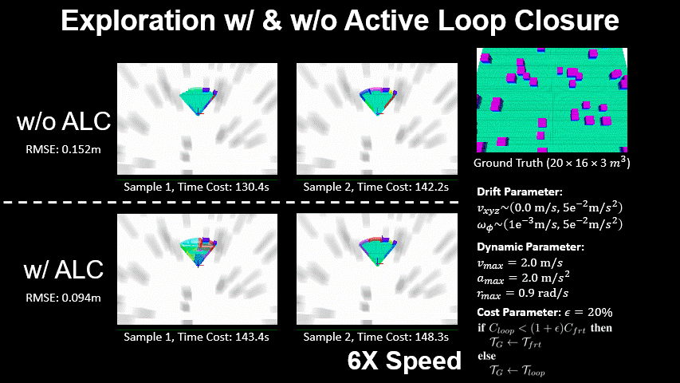
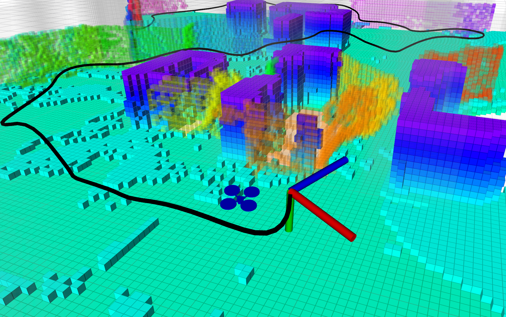
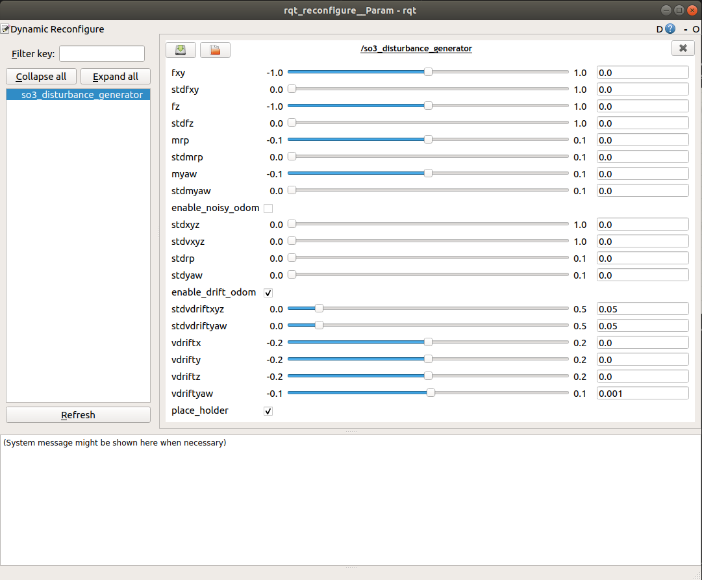

# [ICRA 2022] Exploration with Global Consistency Using Real-Time Re-integration and Active Loop Closure

Despite recent progress of robotic exploration, most methods assume that drift-free localization is available, which is problematic in reality and causes severe distortion of the reconstructed map. In this work, we present a systematic exploration mapping and planning framework that deals with drifted localization, allowing efficient and globally consistent reconstruction. A real-time re-integration-based mapping approach along with a frame pruning mechanism is proposed, which rectifies map distortion effectively when drifted localization is corrected upon detecting loop-closure. Besides, an exploration planning method considering historical viewpoints is presented to enable active loop closing, which promotes a higher opportunity to correct localization errors and further improves the mapping quality. We evaluate both the mapping and planning methods as well as the entire system comprehensively in simulation and real-world experiments, showing their effectiveness in practice.

__Authors__: [Yichen Zhang](https://yzhangec.github.io/), [Boyu Zhou](http://boyuzhou.net), Luqi Wang and [Shaojie Shen](https://uav.hkust.edu.hk/group/) from the [HUKST Aerial Robotics Group](https://uav.hkust.edu.hk/).

<p align="center">
  
  
  
  <!--   -->
  <!--  -->
</p>
 
Video is available at: [video](https://youtu.be/QGg0g9eNUSw).

Please cite our paper if you use this project in your research:
- [__Exploration with Global Consistency Using Real-Time Re-integration and Active Loop Closure__](https://arxiv.org/abs/2204.02693), Yichen Zhang, Boyu Zhou, Luqi Wang, Shaojie Shen, 2022 IEEE international conference on robotics and automation (ICRA)

```
@article{zhang2022exploration,
  title={Exploration with Global Consistency Using Real-Time Re-integration and Active Loop Closure},
  author={Zhang, Yichen and Zhou, Boyu and Wang, Luqi and Shen, Shaojie},
  journal={arXiv preprint arXiv:2204.02693},
  year={2022}
}
```

Please kindly star :star: this project if it helps you. We take great efforts to develope and maintain it :grin::grin:.


## Quick Start

This project is mostly based on [Fast-Planner](https://github.com/HKUST-Aerial-Robotics/Fast-Planner) and [FUEL](https://github.com/HKUST-Aerial-Robotics/FUEL). 
It has been tested on Ubuntu 16.04(ROS Kinetic) and 18.04(ROS Melodic). Take Ubuntu 18.04 as an example, run the following commands to setup:

```
  sudo apt-get install libarmadillo-dev ros-melodic-nlopt
```

To simulate the depth camera, we use a simulator based on CUDA Toolkit. Please install it first following the [instruction of CUDA](https://developer.nvidia.com/zh-cn/cuda-toolkit). 

After successful installation, in the **local_sensing** package in **uav_simulator**, remember to change the 'arch' and 'code' flags in CMakelist.txt according to your graphics card devices. You can check the right code [here](https://arnon.dk/matching-sm-architectures-arch-and-gencode-for-various-nvidia-cards/). For example:

```
  set(CUDA_NVCC_FLAGS 
    -gencode arch=compute_75,code=sm_75;
  ) 
```

Finally, clone and compile our package:

```
  cd ${YOUR_WORKSPACE_PATH}/src
  git clone https://github.com/yzhangec/Exploration-with-Global-Consistency.git
  cd ..
  catkin_make
```

After compilation you can start the visualization by: 

```
  source devel/setup.bash && roslaunch exploration_manager rviz.launch
```
and start a simulation (run in a new terminals): 
```
  source devel/setup.bash && roslaunch exploration_manager exploration_sim.launch
```
You will find a cluttered scene to be explored (20m x 12m x 2m) and the drone in ```Rviz```. You can trigger the exploration to start by
```
  rosservice call /exploration_node/exploration_start
```
Notice that in our simulator, the quadrotor in the following image represents the true (ground truth) pose and the right axis represents the noised camera pose, i.e. drifted pose.

<p align="center">
  
</p>

The default drift setting is $\mu_{xyz} = 0.0$, $\sigma^2_{xyz} = 5e^{-2}$, $\mu_{\phi} = 1e^{-3}$ and $\sigma^2_{\phi} = 5e^{-2}$ with unit $m/s$, which is the s3 drift paramter setting in the paper. You can change the drift paramter setting by run rqt_reconfigure after the exploration node starts
```
  rosrun rqt_reconfigure rqt_reconfigure
```
and then select **so3_disturbance_generator** on the left list

<p align="center">
  
</p>

## Acknowledgements
  We use **NLopt** for non-linear optimization and use **LKH** for travelling salesman problem.
